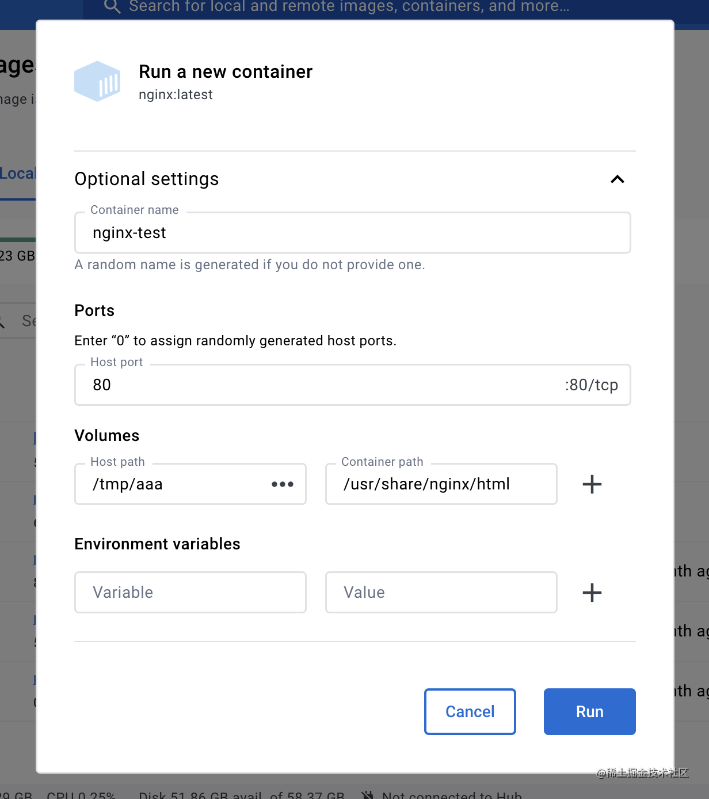

# 常见命令

## Macos

### 查看端口对应的进程

lsof -i :3000

### 查看进程完整执行命令和路径

ps -p `<PID>` -o pid,comm,command

## pm2

以下是 `PM2`（Node.js 的进程管理器） **常用命令汇总清单** ，适合开发和生产环境中使用：

---

## 🚀 启动和管理应用

| 命令                             | 说明                            |
| -------------------------------- | ------------------------------- |
| `pm2 start app.js`               | 启动 `app.js`                   |
| `pm2 start app.js --name my-app` | 启动并指定进程名                |
| `pm2 start ecosystem.config.js`  | 通过配置文件启动多个应用        |
| `pm2 restart app`                | 重启某个应用（可以用名称或 ID） |
| `pm2 reload app`                 | 无缝重启应用（适合生产）        |
| `pm2 stop app`                   | 停止应用                        |
| `pm2 delete app`                 | 删除应用（从进程列表移除）      |

---

## 📋 查看状态和日志

| 命令           | 说明                       |
| -------------- | -------------------------- |
| `pm2 list`     | 查看所有进程的状态         |
| `pm2 status`   | 同 `pm2 list`              |
| `pm2 show app` | 查看某个应用的详细信息     |
| `pm2 logs`     | 查看所有应用的日志         |
| `pm2 logs app` | 查看指定应用的日志         |
| `pm2 monit`    | 进程资源监控界面（交互式） |

---

## 🔧 配置与管理

| 命令              | 说明                                                           |
| ----------------- | -------------------------------------------------------------- |
| `pm2 startup`     | 设置 PM2 在系统启动时自动运行（返回一条你要执行的 `sudo`命令） |
| `pm2 save`        | 保存当前的进程列表，用于开机自动启动                           |
| `pm2 delete all`  | 删除所有 PM2 管理的进程                                        |
| `pm2 stop all`    | 停止所有进程                                                   |
| `pm2 restart all` | 重启所有进程                                                   |

---

## 📦 部署流程（可选）

| 命令                                               | 说明           |
| -------------------------------------------------- | -------------- |
| `pm2 deploy ecosystem.config.js production setup`  | 初始化部署目录 |
| `pm2 deploy ecosystem.config.js production`        | 部署代码并重启 |
| `pm2 deploy ecosystem.config.js production revert` | 回滚上一次部署 |

> 需要 `ecosystem.config.js` 配置文件，适合多服务器部署方案。

---

## 🧾 示例：ecosystem.config.js

```js
module.exports = {
  apps: [
    {
      name: 'my-app',
      script: './app.js',
      instances: 2,
      exec_mode: 'cluster',
      env: {
        NODE_ENV: 'development',
      },
      env_production: {
        NODE_ENV: 'production',
      },
    },
  ],
};
```

---

## 🧠 其他实用命令

| 命令             | 说明                  |
| ---------------- | --------------------- |
| `pm2 reload all` | 无缝重载所有进程      |
| `pm2 flush`      | 清空所有日志          |
| `pm2 env 0`      | 查看进程 0 的环境变量 |

---

如果你想导出/备份 PM2 状态，或做服务迁移，也可以使用：

```bash
pm2 save               # 保存当前状态
pm2 dump               # 生成 dump 文件
pm2 resurrect          # 根据 dump 文件恢复
```

## docker

### 拉取镜像

```bash
docker pull <image>
```

### 查看镜像

```bash
docker images
docker images -a
```

### 运行

```bash
docker run --name <name> -p <hostPort>:<containerPort> -v <hostPath>:<containerPath> -e <env> -d <image>

```

```
docker run --name nginx-test2 -p 80:80 -v /tmp/aaa:/usr/share/nginx/html -e KEY1=VALUE1 -d nginx:latest
-p 是端口映射

-v 是指定数据卷挂载目录

-e 是指定环境变量

-d 是后台运行

```

### 查看容器

```bash
docker ps
docker ps -a
```
